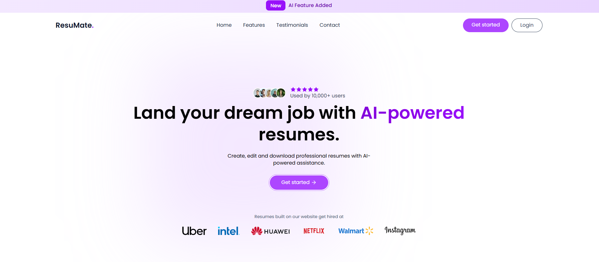
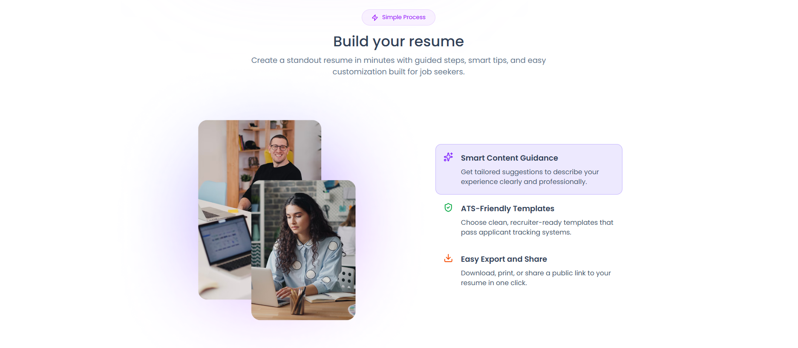
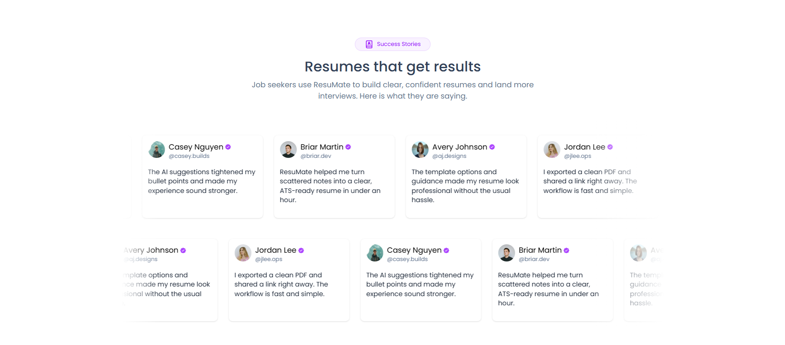
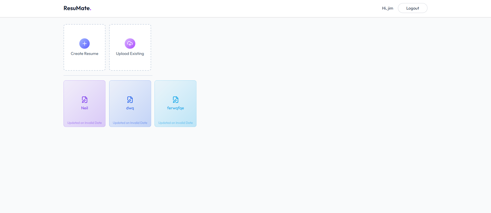
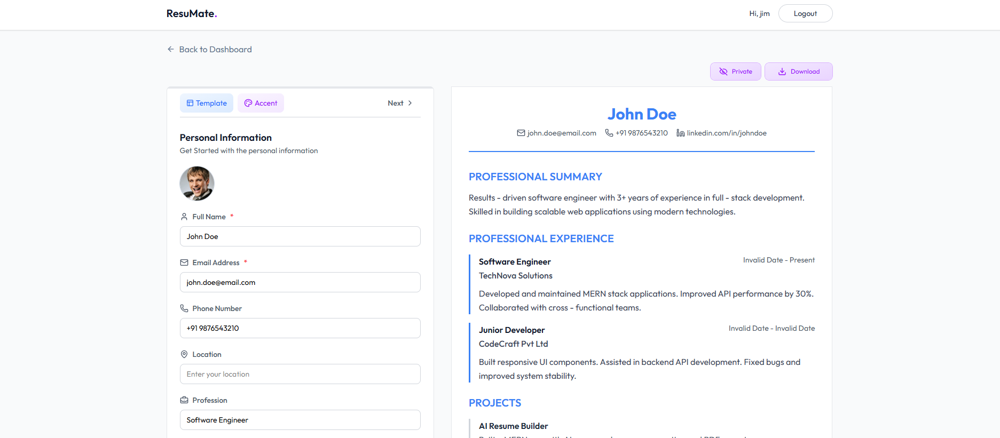
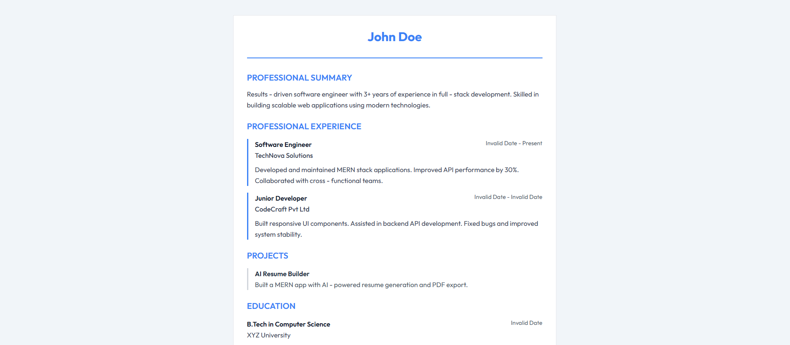

# ResuMate

ResuMate is a full-stack AI-powered resume builder that helps users create, edit, preview, and manage professional resumes quickly. It includes a modern React frontend, a Node.js/Express backend, MongoDB storage, and AI-assisted content generation.

## Features

- User authentication (signup/login with JWT-based protected routes)
- Resume builder with structured sections:
  - Personal information
  - Professional summary
  - Work experience
  - Education
  - Projects
  - Skills
- Multiple resume templates and color/theme selection
- Live resume preview page
- Resume dashboard for managing saved resumes
- AI-assisted resume content generation via OpenAI-compatible API
- Image upload support through ImageKit
- Deployment-ready configuration (Render)

## Tech Stack

- Frontend: React, Vite, Redux Toolkit, Tailwind CSS, React Router
- Backend: Node.js, Express, MongoDB, Mongoose, JWT
- AI/Media: OpenAI SDK, ImageKit, Multer

## Screenshots

### Hero


### Features


### Testimonials


### Login
.png)

### Dashboard


### Resume Building


### Preview


## Project Structure

```text
ResuMate/
  client/    # React + Vite frontend
  server/    # Express + MongoDB backend
```

## Run Locally

### 1. Clone From GitHub

```bash
git clone https://github.com/<your-username>/ResuMate.git
cd ResuMate
```

If you do not use Git:

1. Open your GitHub repository page.
2. Click Code > Download ZIP.
3. Extract the ZIP.
4. Open the extracted folder in VS Code.

### 2. Install Dependencies

From the project root:

```bash
npm install
npm run install-all
```

### 3. Configure Environment Variables

Create a `.env` file in `server/` with:

```env
PORT=3000
CORS_ORIGIN=http://localhost:5173

MONGODB_URI=your_mongodb_connection_string
JWT_SECRET=your_jwt_secret

OPENAI_API_KEY=your_openai_api_key
OPENAI_BASE_URL=https://api.openai.com/v1
OPENAI_MODEL=gemini-2.5-flash

IMAGEKIT_PUBLIC_KEY=your_imagekit_public_key
IMAGEKIT_PRIVATE_KEY=your_imagekit_private_key
IMAGEKIT_URL_ENDPOINT=your_imagekit_url_endpoint
```

Create a `.env` file in `client/` with:

```env
VITE_BASE_URL=http://localhost:3000
```

### 4. Start Development Servers

From the project root (runs client + server together):

```bash
npm run dev
```

Or run separately:

```bash
# Server
npm run server

# Client (new terminal)
npm run client
```

Client runs on `http://localhost:5173` and server runs on `http://localhost:3000` by default.

## Build For Production

```bash
npm run build
```

## Deployment Notes

- `render.yaml` and `check-deployment.sh` are included for Render-based deployment workflows.
- Ensure production environment variables are configured on your hosting provider.

## License

This project is licensed under the ISC License.